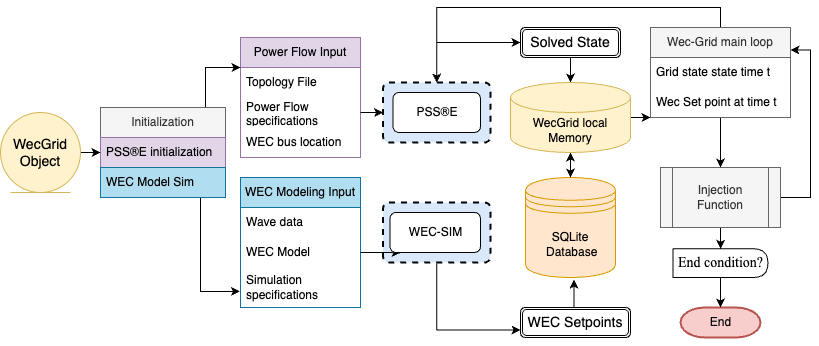
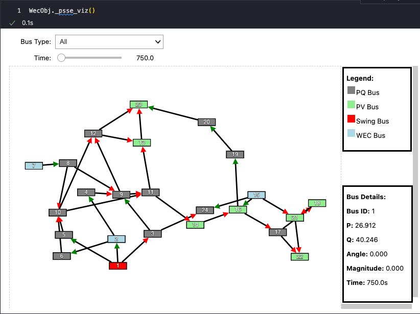

<p align="center">
  
</p>

## WEC-GRID: Integrating Wave Energy Converters into Power Grid Simulations

**WEC-GRID** is an open-source Python library crafted to simulate the integration of Wave Energy Converters (WECs) and Current Energy Converters (CECs) into renowned power grid simulators like [PSS®E](https://new.siemens.com/global/en/products/energy/services/transmission-distribution-smart-grid/consulting-and-planning/pss-software/pss-e.html) & [PyPSA](https://pypsa.org/).

### Introduction

Amidst the global shift towards sustainable energy solutions, Wave Energy Converters (WECs) and Current Energy Converters (CECs) emerge as groundbreaking innovations. These tools harbor the potential to tap into the boundless energy reserves of our oceans. Yet, to weave them into intricate systems like microgrids, a profound modeling, testing, and analysis regimen is indispensable. WEC-GRID, presented through this Jupyter notebook, is a beacon of both demonstration and guidance, capitalizing on an open-source software to transcend these integration impediments.

### Overview

<p align="center">
  
</p>

WEC-GRID is in its nascent stages, yet it presents a Python Jupyter Notebook that successfully establishes a PSSe API connection. It can solve both static AC & DC power flows, injecting data from a WEC/CEC device. Additionally, WEC-GRID comes equipped with rudimentary formatting tools for data analytics. The modular design ensures support for a selected power flow solving software and WEC/CEC devices.

For the current implementations, WEC-GRID is compatible with PSSe and [WEC-SIM](https://wec-sim.github.io/WEC-Sim/). The widespread application of PSSe in the power systems industry, coupled with its robust API, makes it an ideal choice.

<p align="center">
  
</p>

---

### Software Requirements and Setup

#### Prerequisites

1. **Install Miniconda**
   - Download and install [Miniconda (64-bit)](https://docs.conda.io/en/latest/miniconda.html) for Python environment management.

2. **MATLAB**
   - Ensure MATLAB 2021b is installed. [Download MATLAB](https://www.mathworks.com/products/matlab.html). This is the only tested and support verison of MATLAB currently 

3. **WEC-SIM**
   - Install WEC-SIM (latest version). [Get WEC-SIM](https://wec-sim.github.io/WEC-Sim/).
   - Expose MATLAB to Python by installing the MATLAB Engine API for Python. Follow instructions [here](https://www.mathworks.com/help/matlab/matlab_external/install-the-matlab-engine-for-python.html). Instructions are also provided below.

4. **PSSe API**
   - Obtain and configure the PSSe API. Details and licensing are available on the [PSS®E website](https://new.siemens.com/global/en/products/energy/services/transmission-distribution-smart-grid/consulting-and-planning/pss-software/pss-e.html).

---

### Installation Sequence

#### Step 0: Prerequisites
1. Install Miniconda, MATLAB, WEC-SIM, and the PSSe API.
2. Clone the WEC-GRID repository:
   ```bash
   git clone 
3. Confirm conda is installed:
   ```bash
   conda --version
   ```
4. navigate to the WEC-GRID directory:
   ```bash
   cd WEC-GRID
   ```
#### Step 1: Set up the Conda Environment
1. Create the environment using the provided `.yml` file:
   ```bash
   conda env create -f wec_grid_env.yml
   ```
2. Activate the environment:
   ```bash
   conda activate WEC_GRID_ENV
   ```

#### Step 2: Install WEC-GRID
Run the following to install the `WEC-GRID` package in editable mode:
```bash
pip install -e .
```

#### Step 3: MATLAB Engine API Installation
1. Navigate to the MATLAB Engine installation directory:
   ```bash
   cd "C:\Program Files\MATLAB\R2021b\extern\engines\python"
   this will most likely be different for your installation
   ```
2. Run the following command to install the MATLAB Engine API:
   ```bash
   python -m pip install .
   ```
#### Step 3.5: Naviagte to the WEC-GRID directory
---

### Testing the Setup

1. Activate the `WEC_GRID_ENV` environment:
   ```bash
   conda activate WEC_GRID_ENV
   ```
2. Launch Jupyter Lab:
   ```bash
   jupyter lab
   ```
3. Run the example notebooks to verify compatibility with:
   - PSSe
   - WEC-SIM
   - MATLAB API

---

### Contributing

Feel free to contribute or raise issues on our [GitHub repository](https://github.com/acep-uaf/WEC-GRID). Your feedback and collaboration drive the future of WEC-GRID. 🚀
